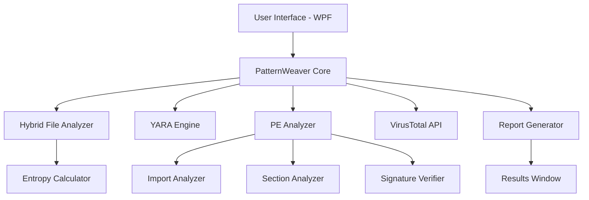

# N.A.Z.A.R.I.C.K. Protocol 🛡️

<div align="center">
  
  
  
  
  
  
  
  **Nefarious Anomaly Zone And Rogue Infection-analysis Countermeasure Kit**
  
  *A comprehensive malware analysis and detection tool for Windows systems*

  [Features](#-features) • [Installation](#-installation) • [Usage](#-usage) • [Documentation](#-documentation) • [Contributing](#-contributing)

</div>

---

## 📋 Overview

N.A.Z.A.R.I.C.K. Protocol is a powerful malware analysis tool designed for security researchers, malware analysts, and power users. It provides a multi-layered approach to threat detection by combining static analysis, pattern matching with YARA rules, and integration with VirusTotal API for real-time threat intelligence.

### 💾 Quick Download

**Ready to use? [Download the latest release (v0.8)](https://github.com/aurojitdas/NAZARICK-Protocol/releases/tag/Version_0.8)** - No compilation required!

## ✨ Features

### 🔍 Core Analysis Capabilities

- **🧬 Hybrid File Analysis** - Deep static analysis with entropy calculation to detect packed/encrypted data
- **📐 YARA Rule Scanning** - Pattern matching using custom-written YARA rules for malware identification
- **🔧 PE File Analysis** - Comprehensive dissection of Windows executables to uncover suspicious characteristics
- **📡 Real-time Monitoring** - Active folder monitoring with automatic scanning of new/modified files
- **☁️ VirusTotal Integration** - Direct submission to VirusTotal's massive malware signature database
- **📊 Detailed Reporting** - User-friendly reports summarizing findings from all analysis modules
- **⚡ Performance Monitoring** - Real-time CPU and memory usage tracking

## 🚀 Installation

### Prerequisites

- Windows 10/11 (64-bit)
- .NET Framework 4.7.2 or higher

### Option 1: Download Pre-built Release (Recommended) 📦

The easiest way to get started is to download the pre-compiled release:

1. **Download the latest release**
   - Go to [Releases](https://github.com/aurojitdas/NAZARICK-Protocol/releases/latest)
   - Download `NAZARICK.Protocol.v0.8.zip` from the latest release
   - Current stable version: [v0.8](https://github.com/aurojitdas/NAZARICK-Protocol/releases/tag/Version_0.8)

2. **Extract and run**
   ```bash
   # Extract the ZIP file to your desired location
   # Navigate to the extracted folder
   # Run NAZARICK Protocol.exe
   ```

3. **That's it!** The application is ready to use.

### Option 2: Build from Source (For Developers) 🔧

If you want to modify the code or contribute to the project:

1. **Clone the repository**
   ```bash
   git clone https://github.com/aurojitdas/NAZARICK-Protocol.git
   cd NAZARICK-Protocol
   ```

2. **Open the solution**
   ```bash
   # Open in Visual Studio
   start "NAZARICK Protocol.sln"
   ```

3. **Build the solution**
   - Visual Studio will automatically restore NuGet packages (dnYara, PeNet, etc.)
   - Build → Build Solution (Ctrl+Shift+B)

4. **Run the application**
   - Press F5 in Visual Studio, or
   - Navigate to `bin/Debug` or `bin/Release` and run the executable

## 📖 Documentation

### 🔬 YARA Rules Explained

YARA is a tool designed to help malware researchers identify and classify malware samples through pattern matching. Think of it as "grep for binaries" with steroids.

#### Structure of a YARA Rule

```yara
rule Example_Malware_Detection
{
    meta:
        description = "Detects suspicious patterns in executable files"
        author = "Security Team"
        date = "2024-01-01"
        severity = "high"

    strings:
        // Text patterns
        $suspicious_text = "malicious_function" nocase
        $api_call = "CreateRemoteThread" wide ascii
        
        // Hexadecimal patterns
        $hex_pattern = { 4D 5A 90 00 03 }  // PE header signature
        
        // Regular expressions
        $regex_pattern = /[a-z]{5,10}\.exe/ nocase

    condition:
        // Detection logic
        $hex_pattern at 0 and 
        any of ($suspicious_text, $api_call) and
        filesize < 5MB
}
```

**Key Components:**
- **meta**: Metadata about the rule (description, author, date)
- **strings**: Patterns to search for (text, hex, regex)
- **condition**: Boolean logic determining when a match occurs

### 📄 PE File Analysis

#### What is a PE File?

PE (Portable Executable) is the native file format for Windows executables (.exe), libraries (.dll), and drivers (.sys). Understanding PE structure is crucial for malware analysis.

#### PE Structure Overview

```
┌─────────────────────┐
│    DOS Header       │  ← Contains "MZ" signature
├─────────────────────┤
│    DOS Stub         │  ← Legacy compatibility
├─────────────────────┤
│    PE Header        │  ← "PE\0\0" signature
├─────────────────────┤
│    File Header      │  ← Machine type, timestamp
├─────────────────────┤
│  Optional Header    │  ← Entry point, image base
├─────────────────────┤
│  Section Headers    │  ← .text, .data, .rsrc
├─────────────────────┤
│    Section Data     │  ← Actual code and data
└─────────────────────┘
```

#### Analysis Performed

The N.A.Z.A.R.I.C.K. Protocol performs the following PE analysis:

| Analysis Type | Description | Suspicious Indicators |
|--------------|-------------|----------------------|
| **Import Analysis** | Examines imported DLLs and functions | Functions like `CreateRemoteThread`, `WriteProcessMemory` |
| **Section Analysis** | Analyzes PE sections properties | Sections with WX permissions, unusual names |
| **Digital Signature** | Validates authenticode signatures | Missing or invalid signatures |
| **Entry Point** | Checks entry point location | Entry points outside .text section |
| **Entropy Analysis** | Calculates file entropy | High entropy (>7.0) indicates packing |

## 🏗️ Architecture

### System Components



### Key Classes

- **`PatternWeaver.cs`** - Central orchestration and scan management
- **`HybridFileAnalyzer.cs`** - Static analysis coordinator
- **`EntropyAnalyzer.cs`** - Shannon entropy calculation
- **`PEAnalyzer.cs`** - PE file structure analysis
- **`VirusTotalAPI.cs`** - VirusTotal integration handler

## 🎯 Usage Examples

### Basic File Scan

```csharp
// Initialize the scanner
var scanner = new PatternWeaver();

// Scan a single file
var results = await scanner.ScanFile(@"C:\suspicious\file.exe");

// Check results
if (results.ThreatDetected)
{
    Console.WriteLine($"Threat found: {results.ThreatName}");
    Console.WriteLine($"Severity: {results.Severity}");
}
```

### Real-time Folder Monitoring

```csharp
// Set up monitoring
var monitor = new FolderMonitor(@"C:\Downloads");
monitor.OnFileChange += (sender, file) => 
{
    // Automatic scan triggered
    scanner.ScanFile(file);
};

monitor.Start();
```

## 🤝 Contributing

We welcome contributions! Please see our [Contributing Guidelines](CONTRIBUTING.md) for details.

### Development Setup

1. Fork the repository
2. Create a feature branch (`git checkout -b feature/AmazingFeature`)
3. Commit your changes (`git commit -m 'Add some AmazingFeature'`)
4. Push to the branch (`git push origin feature/AmazingFeature`)
5. Open a Pull Request

### Code Style

- Follow C# coding conventions
- Use meaningful variable names
- Comment complex logic
- Add unit tests for new features

## 📊 Performance Benchmarks

| File Size | Scan Time | Memory Usage |
|-----------|-----------|--------------|
| < 1 MB | ~100ms | ~50 MB |
| 1-10 MB | ~500ms | ~100 MB |
| 10-50 MB | ~2s | ~200 MB |
| 50-100 MB | ~5s | ~350 MB |

## 🔒 Security Considerations

- Always run in an isolated environment when analyzing suspected malware
- Use virtual machines for testing unknown files
- Keep YARA rules updated regularly
- Never disable Windows Defender while using this tool

## 📝 License

This project is licensed under the MIT License - see the [LICENSE](LICENSE) file for details.

## 🙏 Acknowledgments

- [YARA Project](https://virustotal.github.io/yara/) - Pattern matching engine
- [dnYara](https://github.com/airbus-cert/dnYara) - .NET wrapper for YARA
- [PeNet](https://github.com/secana/PeNet) - PE file parser
- [VirusTotal](https://www.virustotal.com/) - Threat intelligence API

## 📧 Contact

Project Maintainer - [Aurojit Das](https://github.com/aurojitdas)

Project Link: [https://github.com/aurojitdas/NAZARICK-Protocol](https://github.com/aurojitdas/NAZARICK-Protocol)

Latest Release: [Download v0.8](https://github.com/aurojitdas/NAZARICK-Protocol/releases/tag/Version_0.8)

---

<div align="center">
  
  **Built with ❤️ for the security community**
  
  ⭐ Star us on GitHub — it helps!
  
</div>
